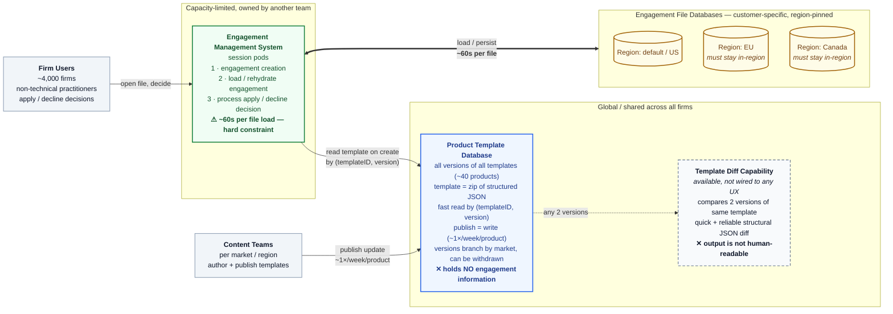

# Current State — What Exists Live Today

Caseware engagement / product-template landscape as described in the exercise brief.
All components are in production. There is no maintenance window.

---

## System context

---

## Components

| Component | Ownership / scope | Key properties | Blocking limitation |
|---|---|---|---|
| **Product Template Database** | Global, shared by all firms; template content is not firm-specific | All versions of all templates across ~40 products; templates are zip archives of structured JSON; fast retrieval by `(templateID, version)`; publish = a write; versions branch per market and are occasionally withdrawn | Retains **no** information about engagement files |
| **Template Diff Capability** | Available utility | Quick, reliable comparison of two versions of the same template → structural JSON diff | Output is machine-shaped; users are non-technical and need prose |
| **Engagement Management System** | Session pods; owned by another team with limited capacity | Single owner of three responsibilities: engagement creation (reads template DB), load/rehydrate (stored form → in-memory, volatile financial fields established at load), and processing the apply/decline decision | **~1 minute per engagement load — treat as a hard constraint** |
| **Engagement File Databases** | Per-customer-firm, isolated, region-pinned (US / EU / Canada) | ~800,000 active engagement files; median firm ~40, largest ~40,000; client-confidential audit workpaper material; each engagement stores the `templateID` + `version` used at creation | Stored form is **not a directly queryable record** of current state |

---

## Flows that exist today

1. **Publish** — Content team writes a new template version to the Product Template Database. Roughly once per week per product, ~40 products.
2. **Create engagement** — Engagement Management System reads the latest template by `(templateID, version)` and instantiates a new engagement file in that firm's regional database.
3. **Open / work** — A user opens an engagement; the Engagement Management System rehydrates it into pod memory (~60s) where volatile financial fields are established.
4. **Decide** — The same system processes an apply or decline decision. (Actually applying updated template content is out of scope for this exercise.)
5. **Diff (latent)** — Any two versions of a template can be diffed on demand, but nothing consumes this in a user-facing path.

---

## The gap

Nothing today can answer **“which of my engagements have pending updates, and what changed?”**

- **No queryable join.** The global template DB and the per-firm engagement DBs share no queryable link. The template side knows nothing about engagements; the engagement side stores a version but not in a readable form.
- **Discovery is prohibitively expensive.** Reading an engagement's template version requires loading it at ~1 min/file. A full sweep of 800,000 files ≈ **13,300 pod-hours** against a capacity-limited dependency owned by another team.
- **Diff is unreadable.** The available diff produces structural JSON, not the practitioner-facing summary required to make an apply/decline judgment.
- **Version history is not linear.** Markets branch, versions are withdrawn after publication, and a firm that declined v5 may later be offered v7 containing v5's changes — so "declined" has no obvious pin in the current model.

**Available extension point:** hooks or events can be added to any action taken by either the product template storage system or the engagement management system.
