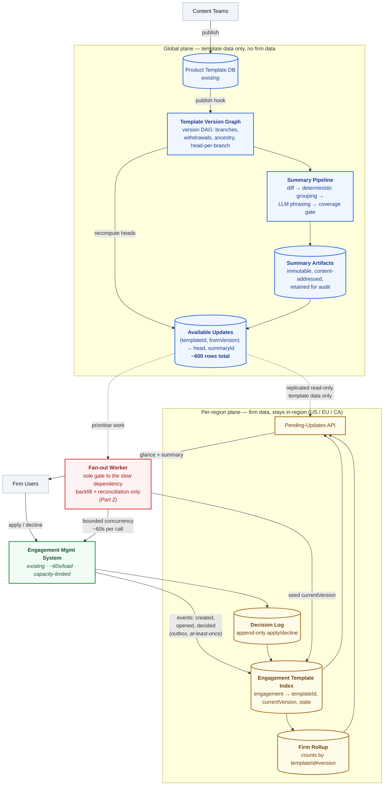
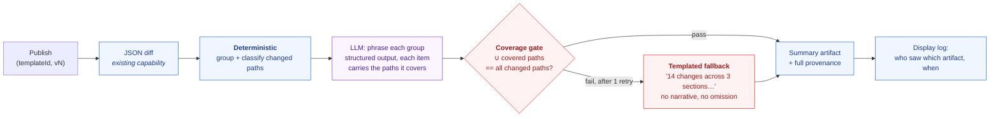

# Pending Template Updates — Design Document (Part 1)

**Scope:** show firms which engagement files have pending product-template updates, and give them a human-readable summary of the inbound changes sufficient to apply or decline. Applying the content is out of scope.

## 0. Stated assumptions

Everything below is either given in the brief or listed here. Three items are mine:

| # | Assumption | Basis |
|---|---|---|
| A1 | **Cost ceiling = $8,000/month**, all-in, inclusive of inference. | The brief leaves «$X» blank. $8,000/mo ≈ $2/firm/mo ≈ $0.01/engagement/mo — defensible for a compliance-differentiating feature. The design lands ~6× under it, so the conclusion is insensitive to the exact figure. |
| A2 | **The engagement-load dependency exposes a configurable concurrency budget; default 16.** The value is owned by the dependency team and changeable without redeploying our worker. | The brief says "limited capacity" without quantifying. Making it a contract rather than a constant is the only honest response to an unquantified limit. |
| A3 | **A firm's engagement IDs are enumerable cheaply** (a list of IDs + owning firm, without loading each file). | Derived, not invented: the brief requires users to "see at a glance which of their engagement files have pending updates," which presupposes the product can already list a firm's engagement files. **Verify before build** — if false, backfill has no work list and Phase 2 below collapses into Phase 1 only. |

The one requirement I would challenge is the real-time requirement. See §5.

---

## 1. Architecture and data ownership

The problem is a join across a boundary that deliberately has no join: template versions are global, engagement state is per-firm, region-pinned, and costs ~60s to read. The design does not try to erase that boundary. It puts a cheap, queryable **projection** of the engagement side next to the template side, and keeps every expensive read behind a single gate.



**Ownership.** The global plane owns template facts only — the version DAG and the summaries. It never stores a firm ID, an engagement ID, or engagement content. The per-region plane owns firm facts only — which engagement sits on which version, and what was decided. The engagement management system remains the sole writer of engagement truth; the index is a derived read model with no authority.

This split is what makes data residency fall out for free rather than being retrofitted. Template content is explicitly not firm-specific, so summaries are computed once globally and replicated read-only into EU and Canada. Firm data never leaves its region, and **no engagement content is ever read by, or sent to, an LLM.** In a client-confidential audit-workpaper domain that is not an optimisation, it is the property that makes the feature approvable.

**Three deliberate structural choices:**

1. **Fan-out writes nothing per engagement.** A publish updates the version graph and writes ~15 rows to a tiny global `Available Updates` table keyed by `(templateId, fromVersion)`. The per-engagement answer is a **read-time join** between a firm's index slice and that table. Cost and publish latency therefore scale with *version count*, not with 800,000 engagements.
2. **The slow dependency has exactly one caller.** The fan-out worker (Part 2) is the only component permitted to call the ~60s path, so the concurrency budget of A2 is enforced in one place and observable in one dashboard. Steady-state operation does not call it at all.
3. **Events for freshness, reconciliation for truth.** Hooks give us seconds-level latency. They are never trusted for correctness; a continuous sampled reconciliation sweep establishes actual divergence (§2).

---

## 2. Correctness and production evolution

### What "declined" pins

A decline pins **one node in the version DAG — not a frontier, and not a set of changes.** The decision log records `(engagementId, templateId, declinedVersion, decidedAt, decidedBy)`, append-only, immutable.

An update is pending for an engagement when there exists a version `V` such that `V` is the head of the engagement's applicable market branch, `V` is a descendant of `currentVersion`, `V` is not withdrawn, and `V` is not in the engagement's declined set. Because the rule tests the *head node* and not the changes it carries, the brief's case resolves correctly: a firm that declined v5 is offered v7, and the summary it sees is the diff `currentVersion → v7`, which includes v5's changes. Declining v5 declined v5, not the content of v5 forever.

This also disposes of accumulation. Several publishes landing before a user decides do not queue N decisions; the engagement is always offered the single current head, with one cumulative summary. That works only because summaries are keyed on the `(from, to)` pair rather than per publish event — the same choice that makes the cost arithmetic work in §3.

**Withdrawal** is the case that breaks naive designs. When a published version is withdrawn, the version graph marks the node withdrawn, heads recompute, and rows in `Available Updates` pointing at it are invalidated within the same write. Summary artifacts referencing it are tombstoned as no-longer-offerable but are **never deleted** — a user may have acted on one in March (§4).

### Unreliable event delivery

The engagement system publishes via a transactional outbox, so an event is never lost relative to a committed state change, and delivery is at-least-once. Consumers are idempotent: index writes are conditional on a monotonic `(engagementId, sourceSequence)`, so replays and out-of-order arrivals are no-ops rather than regressions.

Neither of those makes the index correct — they make it *fast*. Correctness comes from reconciliation: the fan-out worker continuously re-reads a random sample of engagements through the slow path and compares against the index. The divergence rate is a published SLI. If it is non-zero we have a bug and a measurement of it, rather than a silent read model that everyone trusts.

### Migration and backfill

The index starts empty, and 800,000 live engagements have unknown versions. The index is therefore tri-state per engagement — `UPDATE_AVAILABLE`, `UP_TO_DATE`, `NOT_YET_CHECKED` — and the UI shows the third state honestly.

**This is the single most important product decision in the design.** Rendering "up to date" for an engagement we have not actually checked would tell an auditor that no methodology update is outstanding when one may be. The unknown state must be visible, and it must not be styled to look reassuring.

- **Phase 0 — dark deploy.** Index, events and API ship disabled. No user-visible change, no traffic on the slow path.
- **Phase 1 — opportunistic capture.** A hook on engagement load records the version whenever a user opens a file for any reason. Marginal cost is zero: the ~60s load already happened and we are reading a value already in pod memory. Active engagements — the ones whose users care — self-populate without consuming any of the budget in A2.
- **Phase 2 — prioritised sweep** for the cold tail, via the worker, ordered by whether the engagement's product actually has a pending update and by firm activity. Arithmetic in §3.
- **Phase 3 — enable per firm**, largest and most skewed firms last.

Rollback at any phase is a feature flag on the API. The index is derived, so discarding and rebuilding it is always available and never loses firm data.

---

## 3. Scale, cost and operational characteristics

**Given:** 4,000 firms · 800,000 engagements · 40 products · median 40 engagements/firm, largest ~40,000 · ~1 publish/week/product.

### Publish volume and the cost of the summary key

```
Publishes            40 products × 1/week          = 40/week ≈ 173/month
Engagements/product  800,000 / 40                  ≈ 20,000 average
Summaries per publish (capped at 12 live versions) = 12
Summaries/month      40/week × 12 × 52/12          ≈ 2,080
Cost per summary     ~20k in @ $3/M + ~1k out @ $15/M ≈ $0.075 → budget $0.10
─────────────────────────────────────────────────────────────────────
Inference, steady state          2,080 × $0.10     ≈ $208/month
Inference with 3× regen/eval overhead              ≈ $624/month worst case
```

The counterfactual is the point. Summarising per engagement instead of per version pair: `20,000 engagements × $0.10 × 173 publishes/month ≈ $346,000/month` — roughly **1,600× more expensive, for output that would be identical**, because template content is not firm-specific. Keying summaries on `(templateId, fromVersion, toVersion)` is the decision that makes this feature affordable at all.

### Storage, serving and total

| Item | Sizing | Monthly |
|---|---|---|
| Engagement Template Index | 800k rows × ~300 B ≈ 240 MB, ×3 regions | ~$1 |
| Available Updates | 40 products × ~15 versions ≈ **600 rows** | <$1 |
| Summary artifacts (diff + output + provenance, retained for audit) | ~2,080/mo × ~60 KB ≈ 125 MB/mo, ~1.5 GB/yr | ~$5 |
| Index writes (events: create, open, decide) | event-rate, not engagement-count | ~$40 |
| Serving: 3 regions × 3 small services, 2 tasks each | Fargate | ~$550 |
| Inference | above, worst case | ~$624 |
| Observability, KMS, cross-region replication | | ~$150 |
| **Total** | | **≈ $1,400/month vs. $8,000 ceiling (A1)** |

Roughly 6× headroom. The dominant line is idle serving capacity, not inference — which is the correct shape for a feature whose inference cost is bounded by a weekly publish cadence.

### Handling the skew

The largest firm has ~40,000 engagements, so the "at a glance" view cannot scan a firm's engagements on every page load. It reads a **firm rollup** — counts keyed by `templateId#version`, maintained incrementally from the same events. Distinct `(templateId, version)` pairs are bounded by 40 × 15 = 600 regardless of firm size, so the glance view is ≤600 small reads plus a join against a 600-row table for the 40-engagement firm and the 40,000-engagement firm alike. Drill-down to the actual file list is a bounded, paginated index query. Nothing in the read path is O(engagements).

### Backfill arithmetic against the real constraint

```
Full sweep of all engagements   800,000 × 60s = 13,333 pod-hours
  at concurrency 16 (A2 default), continuous  ≈ 833 h ≈ 35 days
  at concurrency 8, off-peak only (12 h/day)  ≈ 139 days
```

Thirty-five days of a full-time claim on another team's capacity is not a reasonable ask, and the design does not make it. Phase 1 covers the engagements users actually touch for free; Phase 2 sweeps the remainder at whatever rate the dependency team grants, and the `NOT_YET_CHECKED` count is the public burn-down metric. The scarce resource here is not dollars — it is another team's capacity, and the design's job is to consume as little of it as possible and to make consumption legible.

### SLOs

| SLI | Target |
|---|---|
| Indicator freshness: publish → `UPDATE_AVAILABLE` visible | p99 < 30 s |
| Summary availability: publish → summary readable | p99 < 10 min |
| Glance view latency (any firm size) | p99 < 300 ms |
| Index divergence (sampled reconciliation) | < 0.1 % of sampled engagements |
| Summary coverage-gate pass rate | > 99 % (below that, we are shipping fallbacks) |
| Backfill burn-down | `NOT_YET_CHECKED` trending to < 5 % |

Failure recovery: the index is fully rebuildable from the decision log plus a re-sweep; the global plane is rebuildable from the template DB. Every stateful component is derived except the append-only decision log, which is the only thing that must be backed up as a system of record.

---

## 4. Generating and evaluating the human-readable summaries

**The LLM does phrasing. It does not do selection.** Which JSON paths changed, how they group into sections, and which changes are material are all computed deterministically from the diff. The model is handed a pre-grouped, pre-classified change set and asked only to render it as prose a non-technical practitioner can act on. This is the single most important constraint in this section: a model that decides what is worth mentioning will eventually decide that something material is not.



**The coverage gate is mechanical, not an LLM judge.** The model returns structured output in which every summary item declares the JSON paths it covers. We then assert that the union of declared paths equals the set of changed paths. A summary that silently drops a change fails a set comparison — not a subjective evaluation. On failure we retry once, then fall back to a deterministic templated summary that is duller but cannot omit anything. Shipping a boring complete summary beats shipping an eloquent incomplete one.

Beyond the gate: a golden set of real historical version pairs with expert-written expected summaries, run on every prompt or model change; drift alarms on fallback rate and on summary length distribution; and human review of a weekly sample plus every fallback, feeding prompt changes.

### Defending a March summary in November

Summaries are immutable and content-addressed by a hash over `(templateId, fromVersion, toVersion, diffHash, promptVersion, modelId, modelVersion, generationParams)`. The stored artifact keeps the **input diff alongside the output**, so the evidentiary chain is complete without needing to re-derive anything from a template DB that has since moved on.

Regeneration never mutates. An improved prompt produces a *new* artifact; the old one stays addressable forever. Separately, a **display log** records which artifact ID was shown to which user at which timestamp, and the decision log records the apply/decline against that same artifact ID. In November the question "what was this practitioner told in March, and what did they decide on the basis of it?" is answered by an exact byte-for-byte retrieval joined to a decision — not by re-running a model that no longer exists at a version that no longer exists. Model deprecation is the reason this cannot rely on reproducibility.

---

## 5. Tradeoffs, the requirement I would challenge, and what I left out

**The requirement I would challenge: "real time — within seconds of a template being published."**

I would split it and accept half. The *indicator* within seconds is free in this design — a publish writes ~15 rows to a 600-row table, so sub-second is the natural outcome and I will commit to p99 < 30 s. The *summary* within seconds I would refuse, and I would propose p99 < 10 minutes instead.

The argument is not that seconds are hard; it is that on the summary path seconds have negative value. Publishes occur roughly once per week per product and firms deliberate over days. Nobody is waiting. Buying seconds on the summary path means generating synchronously inside the publish transaction, which couples content publishing to LLM availability — so an inference outage becomes a publishing outage — and it removes the time budget for the retry and coverage gate in §4. We would be paying real reliability and real correctness for freshness that no user can perceive. Minutes for the summary, seconds for the indicator.

**Other tradeoffs accepted deliberately:** the index is eventually consistent and can be briefly wrong, mitigated by reconciliation rather than by attempting strong consistency across a boundary that does not support it; summaries are per-version-pair and therefore not tailored to a firm's own edits, which costs 1,600× less and loses nothing given template content is not firm-specific; and we capped summarised history at 12 live versions, so an engagement stranded further back gets a templated fallback rather than a narrative.

**Riskiest thing to get wrong: a summary that omits a material change.** A practitioner declines an update, and in November a regulator asks why a required methodology change was never applied. The answer "our summary did not mention it" is a defect in the firm's audit file, and it is unrecoverable — the decision was already made and signed. Every choice in §4 exists for this: deterministic selection, mechanical coverage gate, complete-but-dull fallback, immutable display log. The close second is the index reporting `UP_TO_DATE` for an engagement that is not, which is the same failure wearing different clothes, and is why `NOT_YET_CHECKED` is a visible state rather than an optimistic default.

**Deliberately left out:** applying template content (out of scope, and it is where the genuinely hard merge problems live); conflict detection between a firm's own edits and inbound changes, which would require reading engagement content — precisely the expensive, confidential thing this design is built to avoid touching, and the most significant thing missing; bulk apply/decline across thousands of engagements, obviously wanted by the 40,000-engagement firm and not designed here; notifications and digests; and the authoring UX content teams would need to express branches and withdrawals, which I have assumed the version graph can already be told about.
