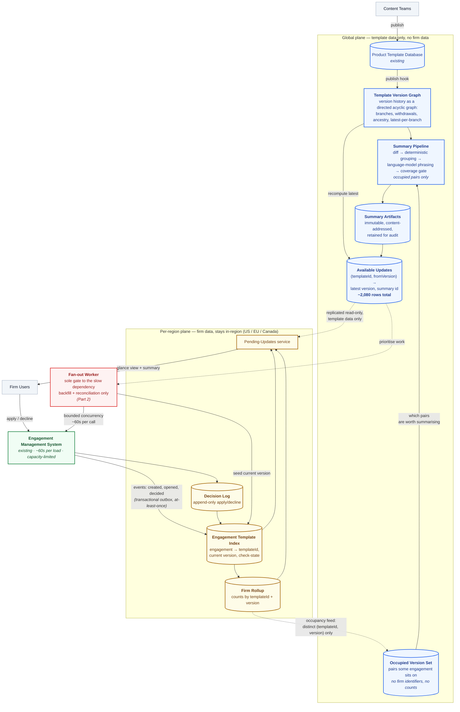

# Target Architecture — Diagrams

Companion to `part1-design-document.md`. Referenced there as **Figure 1** and **Figure 2**.
Renders natively on GitHub, in VS Code, and at mermaid.live.

---

## Figure 1 — Pending-update system, target state

Two planes with a single crossing. The global plane holds template facts only and never stores a firm or engagement identifier; the per-region plane holds firm facts and never leaves its region. The only signal crossing the boundary is the **occupancy feed** — the bare set of `(templateId, version)` pairs that some engagement occupies, carrying no firm identifiers and no counts.

The **Fan-out Worker** is the sole caller of the ~60-second engagement-load dependency, so the concurrency budget (assumption **A2**) is enforced in one place. Steady-state operation never calls it; it exists for backfill and reconciliation only. It is the component implemented in Part 2.

**Legend.** Blue = global template plane · yellow = per-region firm plane · green = existing system, unchanged · red = the single gate to the capacity-limited dependency · dashed = replication or metadata-only flow.

---

## Figure 2 — Summary generation and the coverage gate

One publish triggers roughly 51 independent generations, one per occupied `fromVersion`, each summarising the cumulative diff from that version to the new one.

The division of labour is the point: **everything blue is deterministic, only the purple step is a language model, and the red step is a mechanical check on it.** Selection — which paths changed, how they group, which are material — never goes near the model. The coverage gate is a set comparison, not a model judging a model: each summary item declares the JSON paths it covers, and the union must equal the changed set. A summary that silently drops a change therefore fails an assertion rather than an opinion, and the fallback is duller prose that is structurally incapable of omission.

```mermaid
flowchart LR
    Publish["Publish<br/>(templateId, vN)"] --> Fanout{"For each <b>occupied</b><br/>fromVersion (~51)"}
    Fanout --> Diff["JSON diff<br/>fromVersion → vN<br/><i>existing capability</i>"]
    Diff --> Group["<b>Deterministic step</b><br/>group + classify changed paths"]
    Group --> Phrase["Language model: phrase each group.<br/>Structured output — every item<br/>declares the paths it covers"]
    Phrase --> Gate{"<b>Coverage gate</b><br/>union of declared paths<br/>== all changed paths?"}
    Gate -->|pass| Artifact["Summary artifact<br/>+ full provenance"]
    Gate -->|"fail, after one retry"| Fallback["<b>Templated fallback</b><br/>'14 changes across 3 sections…'<br/>no narrative, no omission"]
    Fallback --> Artifact
    Artifact --> DisplayLog["Display log:<br/>who saw which artifact, when"]

    classDef deterministic fill:#eff6ff,stroke:#2563eb,color:#1e3a8a
    classDef model fill:#faf5ff,stroke:#7c3aed,color:#4c1d95
    classDef gate fill:#fef2f2,stroke:#dc2626,color:#991b1b
    class Diff,Group,Artifact,DisplayLog,Fanout deterministic
    class Phrase model
    class Gate,Fallback gate
```

**Legend.** Blue = deterministic · purple = language model (phrasing only) · red = mechanical gate and fallback.
